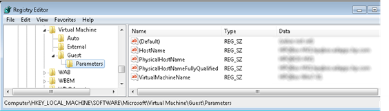

This morning i had an issue with a fileserver that is running as a guest on a Hyper-V server, far away from my location, in fact I did not even know what Hyper-V system is hosting that Fileserver. I wanted to see within Hyper-V manager how the system is doing, but without knowing the Hyper-V server host name, you can’t connect (kind of logic) :-)

  So what’s the name of the underlying server that is hosting my virtual server ? A friend within my team found the answer.

  To my surprise this information is stored within the guest windows registry under HKLM\Software\Microsoft\Virtual Machine\Guest\Parameters as shown in the picture below.

  

