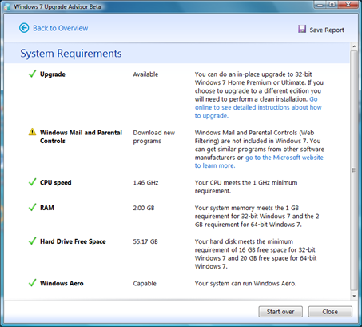

Today Microsoft released the Windows 7 Upgrade Advisor Beta. The tools scans your system and checks if its able to run Winodws7.

  Download [here](http://www.microsoft.com/downloads/details.aspx?displaylang=en&FamilyID=1b544e90-7659-4bd9-9e51-2497c146af15)

  

