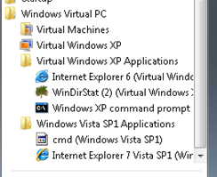
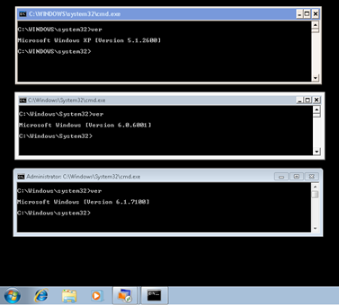

With the release of the Windows7 RC0 build, Microsoft also published a first Beta for Windows Virtual PC that provides the underlying technology for XP Mode feature. Windows Virtual PC cannot only run Windows XP but does also allow running virtualized Windows Vista and Windows 7 clients. 

  After having installed a Windows Vista guest, it’s important to install both the integration features as well as the rail_qfe_beta_for_vista_sp1_x86_343758.msu. If you don’t install the last, you won’t be able to publish applications installed in Vista to your Windows 7 Start Menu. 

  Talking about publishing shortcuts. When you install an application inside your virtual guest (XP or Vista), ,the application shortcut will be published automatically within your Windows 7 host system start menu. If you want to publish shortcuts yourself, simply copy the shortcut at the following locations within your guest system:

  **Windows Vista**: C:\ProgramData\Microsoft\Windows\Start Menu\Programs

  **Windows XP**: C:\Documents and Settings\All Users\Start Menu\Programs

   

  Another thing I noticed is that when you delete a virtual machine from the Virtual Machines list, the sources aren’t deleted from the disk, so you will have to remove the associated files yourself. The Virtual Machine sources by default are stored under: C:\Users\<USERNAME>\AppData\Local\Microsoft\Windows Virtual PC

  The configuration of the virtual machines is stored within that same directory within the file(s) that have a “vmc” extension. 

  Another learning I had to make is that you “MUST” provide a password during the Windows Vista setup procedure, otherwise you won’t be able to logon to the Virtual Machine later. This is related to a security policy restriction that is enabled by default in Windows Vista and doesn’t allow starting an RDP session with a user that has no password. 

  So at the end of the day, I had 3 different command prompts running on my desktop. The Windows XP and Vista ones from the virtualized guests and the Windows7 command prompt from the host system. Just imagine how easy it will be now to test group policy settings or scripts, without having to switch between entire virtual machines. 

  

