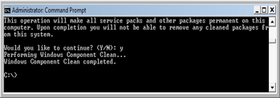

Note that once you have installed Windows Vista Service Pack 2 you can run the compcln.exe utility to make your installation permanent and remove any sources from the previous state. 

  

 After you have executed compcln.exe, you will notice that you get some free disk space back.

