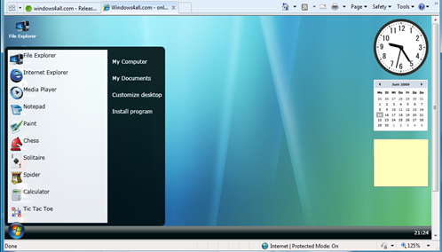

Just took a look on CodePlex to see if there’s any new interesting projects and came across the [Windows4all.com](http://www.windows4all.com/) project. Windows4all.com is a silverlight based website simulating an operating system inside your web browser. 

   By the way, if you’re interested in these type of solutions, there’s also [Wiki-OS](http://mashable.com/2007/08/22/web-os/) or continue reading the [WEB OS article](http://mashable.com/2007/08/22/web-os/) on Mashable.

