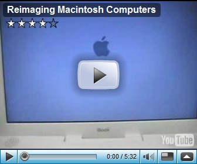

Most of us desktop management consultants focus on the Windows Operating System, so I thought it’s about time to see how things work with other operating systems. I kind of know in theory how a LINUX installation works but Mac computers thus far has been unknown land for me. During my journey of collecting information I came across this video which demonstrates how to re-image a MAC computer. 

    

  Another great information source I found is the [Mac Admin Corner](http://blog.macadmincorner.com/) blog.

