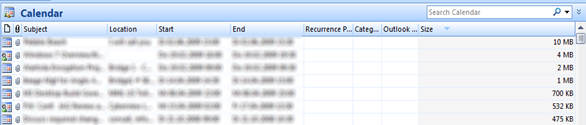

Most companies put storage limits on their users mailboxes. To avoid full mailboxes, some periodic housekeeping is required. This can be done by either using the archiving function or by deleting content manually. 

  To identify calendar entries with large attachments, select your calendar, select View, then Current View, then Outlook Data files. Then click on the “size” column to sort the calendar entries by size. 

  You should now see the calendar entries sorted by its size and start deleting those items that are not needed anymore. 

  

