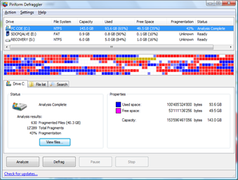

Today I stumbled upon the [Defraggler](http://www.defraggler.com/) utility from [Piriform](http://www.piriform.com/). The tool provides a nice and lean interface to analyze and defrag drives or individual files. But most important, it’s FREE!

  

  Other tools from [Piriform](http://www.piriform.com/) are [CCLeaner](http://www.ccleaner.com/) and [Recuva](http://www.recuva.com/). I wrote about Recuva earlier in this [blogpost](https://www.verboon.info/index.php/2008/10/tooltip-recuva/).

