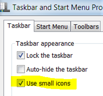
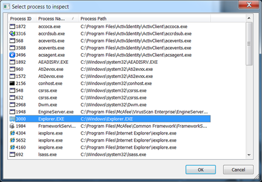
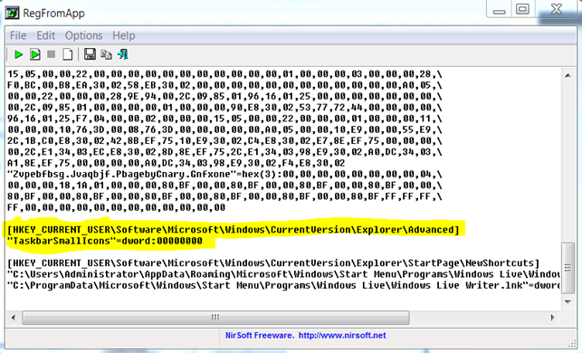

Most Windows Operating System and Application settings are stored within the Windows Registry, so if you want to create a script that automates customized settings, but don’t know the exact registry key location or value, you usually end up creating a so-called registry snapshot that records the changes made to the Windows registry when applying a system or application change.

  Creating registry snapshots can be done with almost every application packaging software like InstallShield, or Wise Package Studio, but requires that you have that software available and installed, which may not be always the case. Furthermore when creating an entire system snapshot you usually still end up with searching through the recorded changes to identify the changed registry key.

  I actually wanted to find out where Windows7 stores the “use small icons” configuration for the Windows Taskbar.

  

  After some web searches, I came across a utility called [RegFromApp](http://www.nirsoft.net/utils/reg_file_from_application.html) from [NirSoft](http://www.nirsoft.net/). This utility does not require an installation process and is FREE.

  Like the tool name says it allows you to track changes made to the windows registry per running process. Since we know that Windows Start Menu and Taskbar runs within the explorer process, we select the explorer.exe and start manually applying the system changes.

  

  As we make the configuration change, the RegFromApp utility starts capturing the changes made to the Windows Registry. To keep the content of tracked changes as short as possible, we stop recording right after having applied the configuration change.

  

  Finally after browsing through the tracked changes, we identify the registry key that handles the “use small icons” setting.

