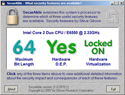

Does your hardware support the Windows7 [XP Mode](http://www.microsoft.com/windows/virtual-pc/get-started.aspx) feature ? Here’s a small and free utility that helps you to find out if your system provides [hardware virtualization](http://en.wikipedia.org/wiki/Hardware-assisted_virtualization) support. 

    

  Download [here](http://www.grc.com/securable.htm)

