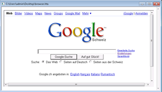

As a response to the European Antitrust Commission, Microsoft will strip the Internet Explorer from Windows7 SKUs aimed for European markets. For end users this means that unless the hardware vendor has a browser pre-installed, which is going to be very unlikely, users must install a browser themselves. 

  So how to download and install a browser if you don’t have a browser to access the internet? The geeks among us would probably use an ftp command and download the browser binaries from some ftp server hosting the browser installation sources. But for regular users, the only options available are to download the browser installation sources upfront on another system that has a browser with internet access and store the installation sources on a USB drive or order the installation media at Microsoft. For access to Internet Explorer 8 click [here](http://www.microsoft.com/windows/internet-explorer/worldwide-sites.aspx)

  ….. but there is another solution, that is actually quite simple and provides you access to the browser download pages without having a browser installed yet. just follow the instructions described below:

  1) Create a new text file on the desktop called browser*.hta*

  2) Edit it with Notepad

  3) Add this line:   
<iframe src=”[http://www.google.com/](http://www.google.com/)” width=”100%” height=”100%” />

  4) Save the file, close Notepad

  5) Double-click *anything.hta* and go get your browser of choice

   Credits for this solution go to my friend Claude Henchoz

