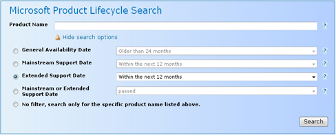
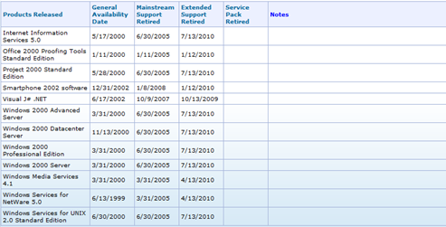

Knowing what products are being used within your IT environment is key. From a technology planning point of view its also important to understand the entire product lifecycle of a given product, especially when the it’s being used by a large amount of users or if its use is business critical. 

  For Microsoft products, the [Microsoft Product Lifecycle Search](http://support.microsoft.com/lifecycle/search/) site can help you creating your technology roadmaps. 

  Simply choose one of the options and select the timeframe. The example below shows all Microsoft products that will go out of extended support within the next 12 months.  

   

  

