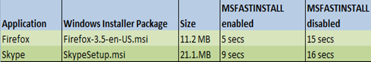

Windows7 comes with Windows Installer 5.0 that has a new installation property called MSIFASTINSTALL. Using the MSIFASTINSTALL property can help reduce time required to install a windows installer package. 

  The trick behind MSIFASTINSTALL is quite simple, it just skips things that consume time like creating a system restore point or calculating the space requirements ([File Costing](http://msdn.microsoft.com/en-us/library/aa368593(VS.85).aspx)). So if you do not need system restore points and know that your clients have enough disk space anyway, you could consider using the MSIFASTINSTALL property to speed up application installations. 

  The table below shows the results of the tests I have performed on Windows7 Enterprise build 7201 with 2 rather small packages. 

   

  I used the following commands:

  msiexec /I Firefox-3.5-en-US.msi MSIFASTINSTALL=1 /l*v C:\MSTTEST\Install.log /qb

  

  msiexec /I skypesetup.msi MSIFASTINSTALL=1 /l*v C:\MSTTEST\Install.log /qb

  Note that I had enabled logging to track the installation duration.  

  More information about the MSIFASTINSTALL property can be found [here](http://msdn.microsoft.com/en-us/library/dd408005(VS.85).aspx). You might also want to take a look at the [FASTOEM](http://msdn.microsoft.com/en-us/library/aa368576(VS.85).aspx) property.

