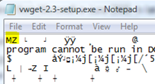

When you open an executable in notepad, you might have noticed that every executable starts with the letters **MZ**

   

  These story behind these two letters is that these are the initials of [Mark Zbikowski](http://en.wikipedia.org/wiki/Mark_Zbikowski) the designer of the DOS executable file format. These two letters are basically telling the system that this is an executable file. 

  It must be a funny idea when going to sleep and knowing that your initials are spread on billions of systems. 

  Watch the [Mark Zbikowski - From DOS 1.0 to Windows Vista](http://channel9.msdn.com/shows/Behind+The+Code/Mark-Zbikowski-From-DOS-10-to-Windows-Vista/) video where Mark speaks about the DOS development and more. 

  Doing some further searching on the web, it appears that there are other file formats carrying the initials of their inventors. ZIP files have the letters **PK** in their file header which are the initials of [Phil Katz](http://en.wikipedia.org/wiki/Phil_Katz) who invented the DOS compression utility PKZIP.

