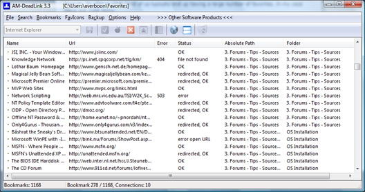

Within our daily life in IT we often find interesting sources of information on the internet or on our company intranet. So after a while, most of us typically end up having a large number of Bookmarks. In my case these are 1168 items. 

  Yesterday I cam across this nice FREE tool called [AM-Deadlnk](http://www.aignes.com/deadlink.htm). With AM-Deadlnk you can check your bookmarks and find out if these are still valid. The utility is smart enough to tell you whether the link is completely dead or if the page has been redirected. 

  

  Beside checking the status of Bookmarks AM-Deadlink can find duplicates, download [FavIcons](http://en.wikipedia.org/wiki/Favicon) and backup your Bookmarks into a ZIP file. Support is provided for Internet Explorer, Mozilla, Firefox and Opera. 

  Click [here](http://www.aignes.com/download/dlsetup.exe) to download AM-DeadLink

