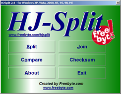

Having troubles with transferring large files? here’s a small and FREE utility called HJ-Split that helps you splitting and joining large files

  Although the GUI looks a bit fancy, the utility works fine. HJ-Split does not require an installation, you can just download and launch it.

  

  Click [here](http://www.freebyte.com/hjsplit/) to download HJ-Split.

