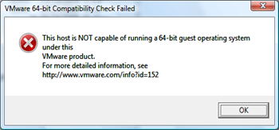
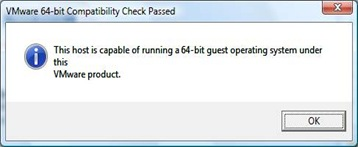

In my earlier post “[Detect XP Mode support](https://www.verboon.info/index.php/2009/07/detect-xp-mode-support/)” I wrote about a utility that checks the system for virtualization support. I have just found a similar one from VMWare that helps detecting if your CPU supports running virtual 64 bit guest operating systems. 

  The VMWare Guest Check utility can be downloaded from [here](http://www.vmware.com/download/ws/drivers_tools.html)

  The following message appears when your system does not support running 64 bit guest operating systems:

  

  The following message appears when your system does support running 64 bit guest operating systems:

  

