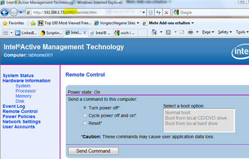

I write most of my blog posts at home in the evenings. Usually when I find a new tool I install these first within a virtual machine, this to not mess our family PC or my laptop I use for work. All Virtual Machines run on a HP dc7800 desktop which has Intel vPro support. This PC is installed down in the cellar. To avoid having to go down there to power on  the PC I have created two batch files that allow me to power up and power down the machine remotely using the Intel AMT power management feature. 

  I have configured AMT in SMB mode as described in the “[vPro Setup and Configuration for the dc7800p Business PC with Intel vPro Processor Technology](http://search.hp.com/redirect.html?type=REG&qt=intel+vpro+provisioning&url=http%3A//h20000.www2.hp.com/bc/docs/support/SupportManual/c01159932/c01159932.pdf%3Fjumpid%3Dreg_R1002_USEN&pos=1)” whitepaper. 

  The utility I use is called RemoteControl.exe that is included within the [Intel AMT Software Development Kit](http://software.intel.com/en-us/articles/download-the-latest-intel-amt-software-development-kit-sdk/). The RemoteControl.exe and StatusStrings.dll can be found in the .\Intel(R) AMT 5.1 SDK Gold\Windows\Intel_AMT\Bin\ folder. 

  The command used in the PowerUp.cmd file is as following:

  remotecontrol -r -user remoteu -pass P@ssword123 http://192.168.1.73:16992/RemoteControlService < powerup.txt

  The command used in the PowerDown.cmd is as following:

  remotecontrol -r -user remoteu -pass P@ssword123 http://192.168.1.73:16992/RemoteControlService < powerdown.txt

  Note that at the end of the command I pipe the input RemoteControl.exe requires with a text file. The powerup.txt has the following content:

  17     
343       
-1       
-1       
-1       
-1 

  The powerdown.txt has the following content:

  18     
343       
-1       
-1       
-1       
-1 

  The first number actually defines what power function is being executed. the following functions are available:

  16 (Reset)   
17 (PowerUp)    
18 (PowerDown)    
19 (PowerCycleReset)    
33 (SetBootOptions)

   

  Finally, if you do not want to use batch files, you can also access the system remote power management features through the remote management web site. http://<system IP address>:16992

  

