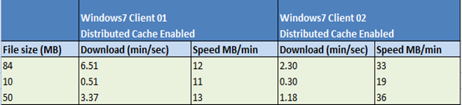

Back in April I was [playing with BranchCache](https://www.verboon.info/index.php/2009/04/playing-with-branchcache/) in my home lab environment to get an idea about how things are supposed to work but simulating a real world WAN network isn’t that easy, unless you have access to some expensive software or you can simulate a network on a Linux box, but unfortunately my knowledge with Linux is near zero. So to see how [BranchCache](http://www.microsoft.com/windows/enterprise/products/branchcache.aspx) really works out in a real environment, I asked a colleague to setup a Windows 2008-R2 system with BranchCache enabled within a remote location that could be accessed through our corporate WAN. Once that system was setup BranchCache configuration was applied and Group Policies were prepared, as described within the [BranchCache Early Adopter’s Guide](http://www.microsoft.com/downloads/details.aspx?FamilyID=A9A1ED8A-71AB-468E-A7E0-470FD46E46B3&displaylang=en). 

  As a next step I copied some different files with different file sizes to the share located on the BranCache enabled server. 

  I then took two Windows7 Enterprise clients that were joined to the test domain and got the BranCache settings applied through Group Policies. 

  Finally I started copying the previously prepared files to the first system called Windows7Client01 and then copied the same content to the second system called Windows7Client02. 

  As shown in the table below, file copy duration could be dramatically improved on Windows7Client02, this because it would actually copy the files from the BranchCache located on Windows7Client01.

  Looking at the first row, copying a file of 84 MB to the first system took 6 minutes and 51 seconds, copying the same file to the second system took only 2 minutes and 30 seconds. That does make a difference!

   

  Throughout testing BranchCache I had to learn that BranchCache for SMB is dependant on offline files (transparent cache). 

  Each time I had completed my test scenario, I cleared the *BranchCache* Cache by using the following command: “netsh branchcache flush” this would remove any previously copied files from the local cache. So when copying the files from the share to Windows7Client01 the file copy duration supposed to take longer as there should not be any local cache available. However interesting enough, the file copy command went as quick as if the content would be cached locally already. 

  Assuming that this was a bug, I reported this to Microsoft, who provided me with the following feedback:

  *“Branchcache for SMB is dependant on offline files(transparent cache). Transparent cache is a secondary cache where the file is stored in addition to the BranchCache. Storing the file in the transparent cache enables subsequent reads of the file to be satisfied locally improving end-user response times and savings on WAN bandwidth.”*

  So I cleared the *BranchCache* Cache using the “netsh branchcache flush” command again , but also cleared the offline files cache through the Offline Files applet within the control panel. Now any previously copied content was really completely removed from the client, so I was sure not being fooled by the system again. 

  Especially for users who work in remote offices and accessing file content hosted in a remote data center Windows7 BranchCache will definitely improve user experience. For companies that use Microsoft System Configuration Center Manager 2007 SP2 it might be interesting to know that SCCM SP2 will also provide P2P support for Windows7 (BranchCache).

