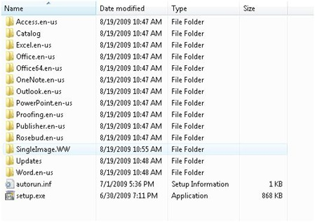
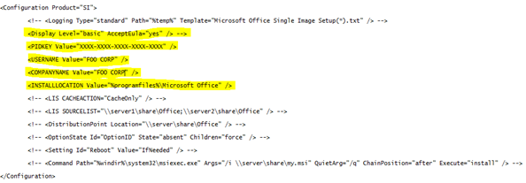

Being one of the lucky ones who was able to sign-up to the Microsoft Office 2010 Technical Preview program, I have started looking at the deployment of Microsoft Office 2010 today. 

  My first observation was that unfortunately the provided documentation seems to be ahead of the Office Installation sources that have been made available for download. I noticed this when making an attempt to run the setup.exe /admin command which would normally launch the Office Customization Wizard, but it wouldn’t because the necessary components that are usually located within the Admin folder aren’t available yet, in fact the whole Admin folder as such seems to be missing. OK, so no advanced customizations for now, back to basic. 

  The current Office 2010 beta that is made available for download is packaged into an executable called “O2010_SingleImage_retail_ship_x86_en-us.exe”. (32 bit version). To create the administrative installation point, extract the content using the following command: 

  O2010_SingleImage_retail_ship_x86_en-us.exe /extract:c:\office2010

  You should then see the following content within the C:\Office2010 folder.

  

  As a next step, open the config.xml file located within the folder SingleImage.WW and modify the file as shown below. (replace the product key with the one you received). 

   

  And finally create a batch file that runs the following command:

  setup.exe /config SingleImage.WW\config.xml 

  Office 2010 Beta will now be installed in silent mode. this might be helpful when planning an automated deployment for testing purposes. 

  More about Office 2010:

  [Microsoft Office 2010 Engineering blog](http://blogs.technet.com/office2010/)

  [Backstage with Office 2010](http://www.office2010themovie.com/)

  [Office 2010 – The Movie](http://www.youtube.com/watch?v=VUawhjxLS2I) (I recommend watching this one)

  [Office 2010 for IT Pros](http://edge.technet.com/Media/Office-2010-for-IT-Pros/)

  [A Look At Office 2010 with Chris Capossela](http://channel9.msdn.com/posts/LarryLarsen/A-Look-At-Office-2010-with-Chris-Capossela/)

