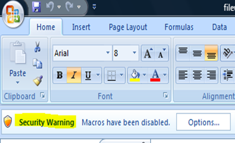
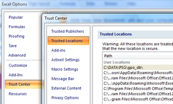
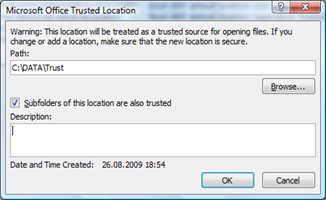

When opening an Excel file that contains macros, Microsoft Excel 2007 shows a security warning as shown in the picture below and disables the macros. 

   

  To continue using the Excel sheet and its macros, you must first enable then by clicking on the "Options…” button and selecting the “Enable this content” option. This is quite annoying if you must use that same file on a regular basis. You could of course completely disable this security warning on your entire system, but then there is a risk of opening content once that could contain unwanted code. 

  But if you are sure about files that are located at a specific location can be considered as save, you can configure Trusted Locations in Excel 2007. Once that folder is configured as a trusted location, your Excel files will open without disabling the macros. 

  To configure Trusted Locations in Excel 2007, press the **Alt+F** key and then the **Alt+I** key to access the Excel Options, then select “Trust Center”, “Trust Center Settings”, “Trusted Locations”. 

    

   Then select “Add new location”. I used **C:\data\trust** for this example. 

   

  Press the “OK” button to confirm your configuration.

