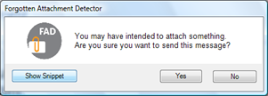

You probably all know this one. You write an e-mail that mentions an attachment and you send it out. Then a few minutes later, one of the recipients who actually did read your mail properly replies, telling you that there was no document attached. So you end up replying to all with the document mentioned attached and apologizing for not having it attached in your first message. 

  Today when I was actually searching for something totally different, but related to MS Office 2007, I came across the “[Forgotten Attachment Detector](http://www.officelabs.com/projects/forgottenattachmentdetector/Pages/default.aspx)” add-in for Outlook. 

  This FREE add-on will give you a warning message if you have pushed the Send Button in case you have mentioned an attached document, but the mail doesn’t contain any attachments. 

  

  The Add-in can be downloaded from [here](http://www.officelabs.com/projects/forgottenattachmentdetector/Pages/default.aspx)

  Speaking about useful things for Outlook, also read out my earlier blog post “[Don’t send outlook messages without subject](https://www.verboon.info/index.php/2009/01/dont-send-outlook-messages-without-subject/)”.

