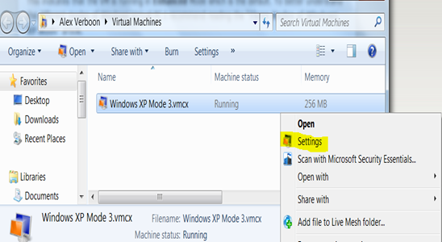
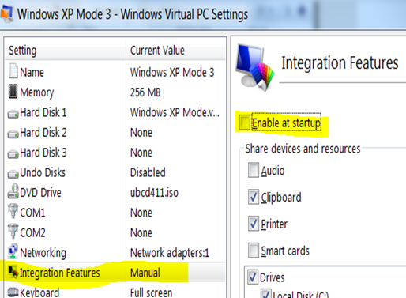
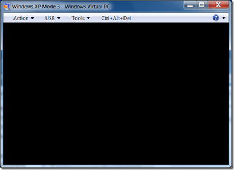
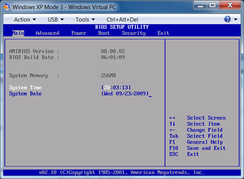

When setting up a Virtual Machine in Windows Virtual PC, You will see the following progress window when the VM is started. This indicates that the VM is running in **Enhanced** Mode which is the default. To better understand the different modes of Windows Virtual PC I recommend reading the “[Three Modes of Windows XP Mode](http://blogs.technet.com/windows_vpc/archive/2009/08/27/three-modes-of-windows-xp-mode.aspx)” article. 

  The progress windows is being displayed until the OS running in the VM has started up, so you have no chance to interrupt the boot process to access the BIOS. To get access to the VM BIOS, you  must run the VM in **Basic** Mode. Running a VM in Basic Mode means that you must disable the integration features. 

  The Integration Features can be disabled within the Virtual Machine settings. In a running VM, select the Tools Menu, then Settings, or if you haven’t started the VM yet, select the VM in the Virtual Machine Explorer and select Settings at the right mouse click context menu. 

  

   Select the Integration Features option and unselect “Enable at Startup”.

    

  The next time you start the VM, you will see the boot window instead of the progress window. 

  

   Now press the “DELETE” key during the VM boot process to get access to the VM’s BIOS settings. 

   

  Related Content:

  [Windows Virtual PC Team Blog](http://blogs.technet.com/windows_vpc/default.aspx)

  [Virtual PC Guy’s WebLog](http://blogs.msdn.com/virtual_pc_guy/default.aspx)

