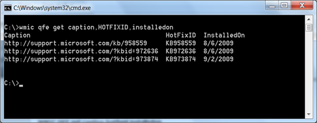
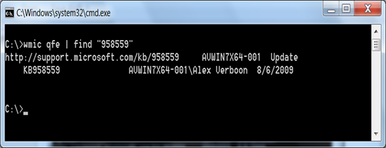

Instead of opening several windows, here’s an easy way to get a list of installed QFE’s. simply open a command prompt and type:

  **WMIC QFE **

  or

  **WMIC QFE get caption,hotfixid,installedon**

  

  or if you are looking for a specific update, enter the following command:

  **WMIC QFE | find “958559”**

  where 958559 relates to the MS KB number. If the QFE is installed, it will be listed.

  

  Related posts:

  [3 seconds to get system serial number](https://www.verboon.info/index.php/2008/09/3-seconds-to-get-system-serial-number/)

