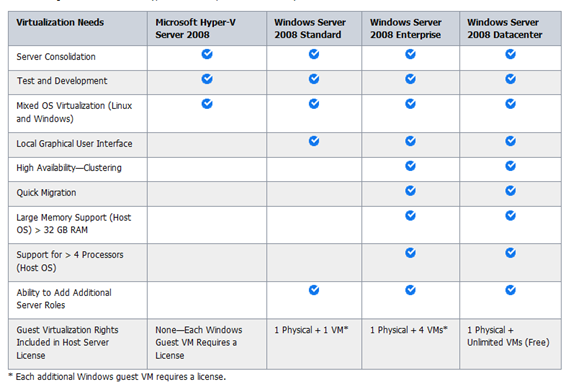

When talking about Hyper-V with customers or colleagues, I notice that there is quite some confusion around the definition of Hyper-V Server and Windows Server 2008 with Hyper-V. 

  **Hyper-V Server 2008 / 2008-R2     
**The Hyper-V Server is a stand-alone product, which contains only the Windows Hypervisor, Windows Server driver model and virtualization components.  What’s important to know, the Hyper-V Server comes for [FREE](http://www.microsoft.com/downloads/details.aspx?FamilyID=48359dd2-1c3d-4506-ae0a-232d0314ccf6&displaylang=en)!. 

  No, Hyper-V Server is not just Windows Server Core + Hyper-V, the only thing this server is designed for is virtualization and therefore does not contain any other server roles. 

  **Windows Server 2008 / 2008-R2 with Hyper-V     
**Here Hyper-V is an enabled server role running on Windows Server 2008 (64 bit) or Windows Server 2008 R2 (note that Server 2008 R2 only comes in 64 bit). 

  The below table provides an overview of the Hyper-V Server and Windows Server products. 

   

  Source: Microsoft

  Other Sources:

  [Microsoft Hyper-V Server 2008](http://www.microsoft.com/hyper-v-server/en/us/default.aspx)

  [Microsoft Windows Server 2008 R2](http://www.microsoft.com/windowsserver2008/en/us/default.aspx)

  [Microsoft Hyper-V Server 2008 R2 Preview](http://www.winsupersite.com/server/hyperv2_preview.asp) (Paul Thurrot)

  [Microsoft TechNet – Hyper-V](http://technet.microsoft.com/en-us/library/cc753637(WS.10).aspx)

  [First Look: Hyper-V Server](http://edge.technet.com/Media/First-Look-Hyper-V-Server/)

