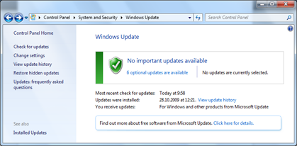
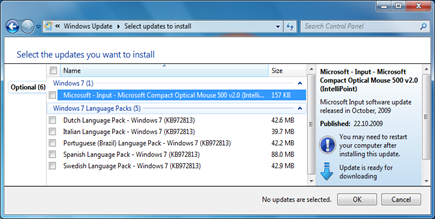
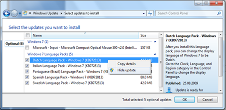
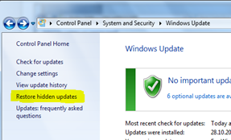
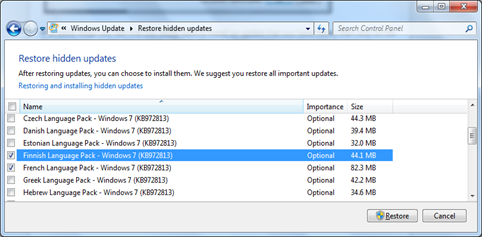

When opening Windows Update, you might see a number of Important and optional updates that are available to your system. But what to do if you are not interested in installing one of these updates? Over time the list will keep growing as new updates will be released and it becomes quite an annoying job to go over the entire list over and over again. 

  When you click on the “optional updates are available” link, all updates are listed as shown in the picture below. 

  So if don’t intent to install certain updates, then select these and within the right mouse context menu select "Hide Update”, this will make the update disappear from the updates list. 

  If at some stage you feel that you would want to install an update that you have hided, then click on the “Restore Hidden Updates” link which will then show you all the updates you have hided previously. 

  You then select the updates you would like to get back in the list again, and click on the Restore button. The word Restore might be a bit misleading, but no worries, it will not install anything yet, it just adds the update back into the available updates list.  

   

  I’ve spend some time to figure out where the system stores this information (hided updates), but besides the c:\windows\windowsupdate.log file, I was not able to figure out where in the registry or file system this information is being stored. Any hints are welcome.

