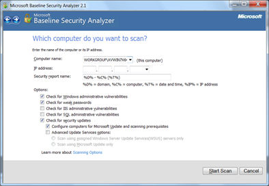

With the launch of Windows 7 Microsoft also released an updated version of the Microsoft Baseline Security Analyzer also known as MBSA. The version is 2.1.1 which is indicating that this is basically just a minor revision of the previous MBSA 2.1, and that is exactly what it is . MBSA 2.1.1 does not appear to bring any new features other than adding support for Windows 7 and Windows Server 2008 R2. 

  Hoping to find at least something new, i had [extracted](https://www.verboon.info/index.php/2009/04/tooltip-less-misrables-msi-file-extractor/) the content of the the MBSASetup-x64-EN.msi of both versions, but could not find any differences other than some updated readme and about files and the new compiled executables. Also when launching the new MBSA it’s only showing 2.1 and not 2.1.1. 

  

  The MBSA 2.1.1 can be downloaded from [here](http://www.microsoft.com/downloads/details.aspx?displaylang=en&FamilyID=b1e76bbe-71df-41e8-8b52-c871d012ba78#filelist)

