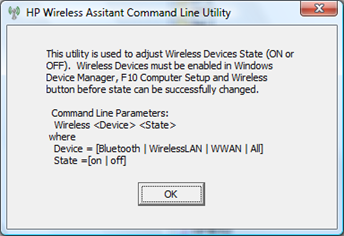
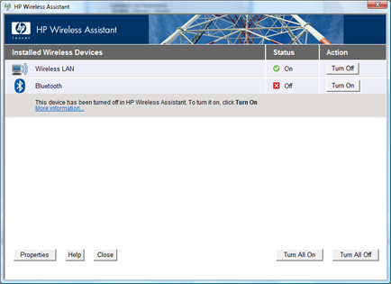

An old colleague called me up this week (well in fact it was my old boss who has left our company), and told me about an issue they had when deploying an ISP specific Software Package that interacts with the Wireless Devices on their HP notebooks.

The problem was that if the WWAN device has been turned of via the quick launch button by the end user, the software would not install.

What many don’t know is that there is a command line  utility that allows you to automate the Wireless Device State on HP devices. If you have the HP Wireless Assistant Software installed, you should have the utility wireless.exe stored under C:\Program Files\Hewlett-Packard\HP Wireless Assistant.

Launching wireless.exe without providing any command line options will show a dialog box describing all available command line parameters.

So if you want to enable all Wireless Devices automatically on a HP notebook system, then simply run the following command:

C:\Program Files\Hewlett-Packard\HP Wireless Assistant\Wireless.exe all on

Or if you just want to turn on the Wireless Lan Device, use the following command:

C:\Program Files\Hewlett-Packard\HP Wireless Assistant\Wireless.exe WirelessLAN on

You can see the state of the individual Wireless Devices within the HP Wireless Assistant Application.

