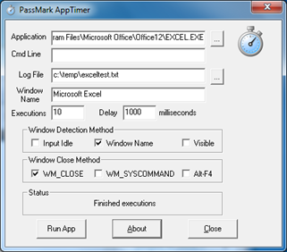

Just found this nice little FREE Utility. AppTimer from [PassMark Software](http://www.passmark.com/index.html) will run an executable a number of times and time how long it takes for the application to reach a state where user input is being accepted before exiting the application.

   AppTimer can be downloaded from [here](http://www.passmark.com/products/apptimer.htm)

