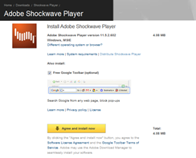
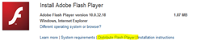

Adobe Flash and Shockwave are probably one of those most installed applications on home and enterprise computers. Working within the End User Computing environment for large enterprise customers since quite a while, I can’t remember of just one company that wouldn’t maintain Adobe Flash and Shockwave in their list of enterprise standard applications. 

  But when it comes to distributing these applications, many companies seem to go down the difficult route instead of taking the easy one. When distributing applications within Enterprise environments, you want them to install automatically, hence you need a software package. 

  Many companies seem to create their Adobe Flash and Shockwave installation packages by capturing the installation sources that are used when initiating an end user installation from the Adobe website as shown in the picture below. 

  

  The challenge of this method is that you need to capture the sources while the web based installer is running (these are stored temporarily on the system) and that you probably want to get rid of any additional software that is being installed such as the Google Toolbar in this case. 

  Many people seem not to be aware that Adobe does provide redistributable media for enterprise deployment of their Adobe Flash and Adobe Shockwave players. On the download pages of the appropriate Player, you will see a link called “*Distribute Flash Player*” or “*Distribute Shockwave Player*”

                        

                         

                  

  By clicking on one of these links you are being redirected to the [Adobe Player Licensing](http://www.adobe.com/products/players/fpsh_distribution1.html) website where you find the links to apply for a license and obtain the installation media to distribute the players within your enterprise. 

  [License Flash Player ›](http://www.adobe.com/go/fp_distribution2)    
[License Shockwave Player ›](http://www.adobe.com/cfusion/entitlement/index.cfm?e=shockwave)

  You will have to provide some information like Company name, number of seats and the operating system used. Once you have submitted your request, it takes about 5-10 minutes until you will receive an e-mail with the links to download the players. 

  Well, that is what I consider as taking the easy route, clicking on a link, filling in a form, and after let’s say 15 minutes you get the *install_flash_player_10_plugin.msi* for Flash and *sw_lic_full_installer.msi* for Shockwave and you’re ready to go. 

  A similar method is available for Adobe Reader. I plan to post an article about that soon.

