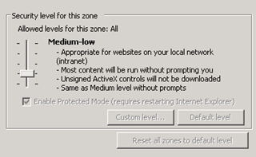
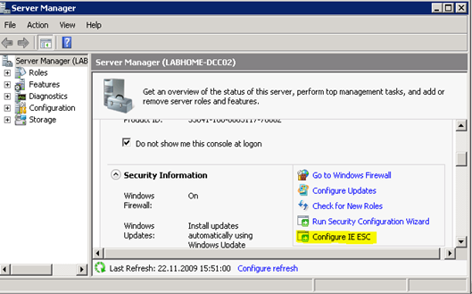
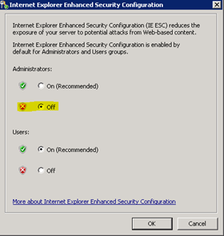
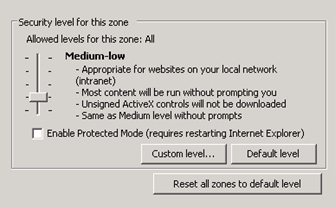

While I was preparing my home lab for some Group Policy tests i wanted to perform I got an error when generating a report in the Group Policy Management Console which is running on a Windows Server 2008 with Internet Explorer 8. 

  The error was: “An error occurred in the script in this page”

  A search on the web indicated that this had to do with the Internet Explorer Security Settings, but when I opened the Internet Explorer Security settings I noticed that I could not change them since all buttons were grayed out. 

   

  But wait a minute, I’m the Administrator on this box, so why should I not be able to change these settings?. Another search on the web pointed me to the Internet Explorer 8 Enhanced Security Configuration which places the server and Internet Explorer in a configuration that decreases the exposure of servers to potential attacks. 

  To configure the Internet Explorer Enhanced Security Configuration you must open the Server Manager and start “Configure IE ESC” as shown in the screen shot below. 

   

  Then turn of IE ESC for Administrators. 

   

  Start Internet Explorer again, and you notice that you can now configure the Security Settings. 

   

  I then clicked on “Reset all zones to default level”. The next time I opened the Group Policy Manager, I could run the settings report without any error. 

  **Resources:     
**[Internet Explorer 8 Enhanced Security Configuration](http://technet.microsoft.com/en-us/library/dd883248(WS.10).aspx)

