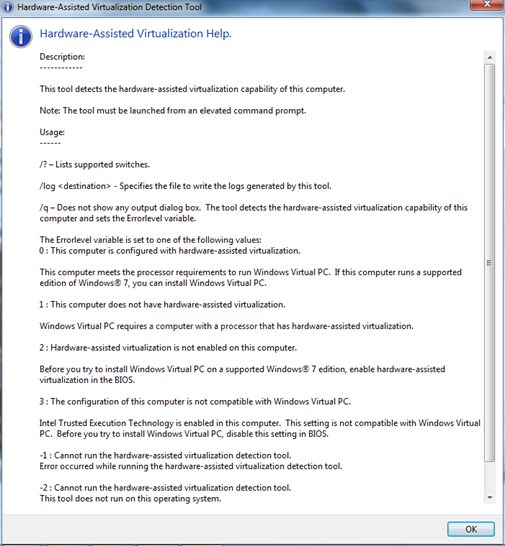

Windows Virtual PC requires that your hardware supports hardware-assisted virtualization. There are a number of third party utilities around already, but now Microsoft released one as well. It’s called the Hardware-Assisted Virtualization Detection Tool and can be downloaded from [here](http://www.microsoft.com/downloads/details.aspx?FamilyID=0ee2a17f-8538-4619-8d1c-05d27e11adb2&displaylang=en#filelist)

  If you launch the tool manually it will tell you if your system meets the requirements for running Windows Virtual PC or not, quite similar as the Securable utility I wrote about in the [Detect XP Mode Support](https://www.verboon.info/index.php/2009/07/detect-xp-mode-support/) article. 

  But since I usually work in enterprise environments, I’m more interested in command line automation than in visual user interfaces, so let’s see what we have here. 

  When downloading the tool you get the havdetectiontool.exe, which is a self extracting executable. So the next step is to extract the content which we do by running the havdetectiontool.exe /x command which will prompt you for a location where to store the content. Once extracted you will see a havtoollauncher.exe and a subdirectory called Sources that contains the havtool executables for both 32 and 64 bit clients. 

  I was not able to find any command line options for the havtoollauncher.exe itself, so i moved on the to the 32 bit version of the havtool.exe. And yes, indeed the tool does provide command line options, Hura!

  

  

  Executing the following command will parse the output into a log file:

  **havtool /log havresult.txt /q**

  Content of havresult.txt

  System CPU doesn't support Hardware Assisted Virtualization.     
BIOS Vendor : Hewlett-Packard      
BIOS Version : F.22     
System Manufacturer : Hewlett-Packard      
Final returnValue = 1

  Executing the following commands will set the result into the Errorlevel variable and then create a new System Variable called HAV and sets its value with the Return code. 

  **havtool /q       
SETX /M HAV %ERRORLEVEL%**

  Setting a system variable is just one example, you could also write a custom registry key or log file. Once you have marked your system with the result, you can use your system management software such as SCCM 2007 to collect the data and create your custom reporting.

