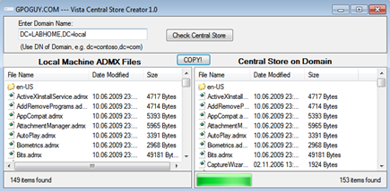

One of the things to consider when deploying Windows 7 clients is to update the Central Store on your domain controllers. If you haven’t created a Central Store yet, I recommend you watch the video or read the documentation I have listed at the end of this post.

If you do have a Central Store already, updating it with the Windows 7 Group Policy Administrative templates is very straight forward. You simply copy the templates that are stored under **C:\Windows\PolicyDefinitions** on your Windows 7 client to the Central Store which is located at **\\FQDN\SYSVOL\FQDN\policies\PolicyDefinitions** (FQDN = fully qualified domain name)

A good alternative for copying the files manually is the [Vista Central Store Creator Utility](http://www.gpoguy.com/FreeTools/FreeToolsLibrary/tabid/67/agentType/View/PropertyID/88/Default.aspx) from Darren Mar-Elia which automates the whole process of creating and updating the Central Store.

 **Related Content
**[Screencast: How-To Configure the Central ADMX Store](http://edge.technet.com/Media/Screencast-How-To-Configure-the-Central-ADMX-Store/)
[How to create a Central Store for Group Policy Administrative Templates in Window Vista](http://support.microsoft.com/kb/929841)
[Group Policy Settings References for Windows and Windows Server](http://www.microsoft.com/downloads/details.aspx?FamilyID=18c90c80-8b0a-4906-a4f5-ff24cc2030fb&displaylang=en)

63EHNFN6ZWK8

