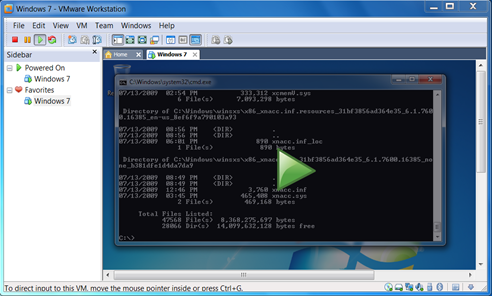
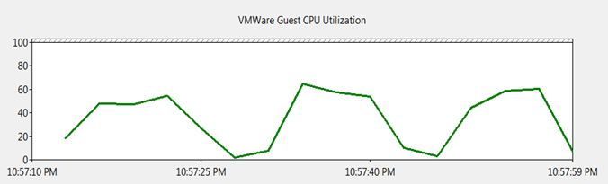

As I wrote in my [earlier post](https://www.verboon.info/index.php/2009/10/vmware-workstation-7-rc-available/) this month, VMWare published a Release Candidate for VMWare Workstation 7. One of the most interesting new features (to me) is the Pause feature that is described as following:

  *The pause feature causes a virtual machine to cease operation temporarily, without powering off or suspending. Use the pause feature when a virtual machine is engaged in an lengthy, **processor-intensive** activity that prevents you from using your computer to do a more immediate task.* 

  

  *VMWare Guest in Pause Mode*

  For those of you that have been using VMWare before, you probably know that situation where nothing goes anymore on your system because your 1 or 2 or even more VM’s consume all of your system resources. Well that’s exactly where the Pause feature will be of great help. 

  Note The Pause Feature does only release CPU usage, not Memory. The graph below shows the Host system CPU utilization of a Windows 7 64 bit client, where a VM Guest, running on Windows 7.

  To simulate CPU load within the Guest OS , i simply executed a dir c:\*.* /s command and I then “paused” and “re-enabled” the VM twice after a few seconds. 

  

