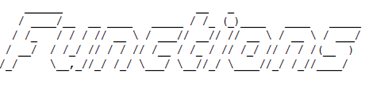
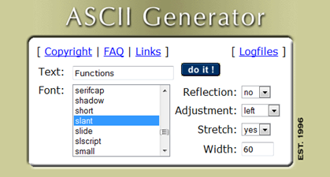
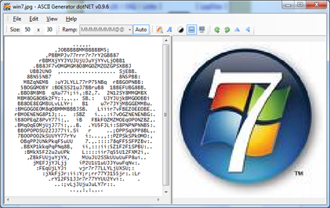
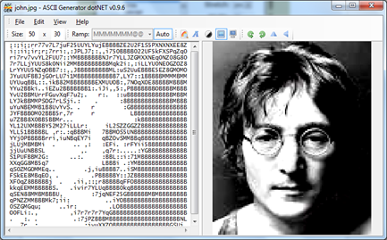

I recently got some scripts that were nicely written, meaning well formatted, documented and structured. What I liked most was the clearly visible separation of the main code and the subroutines. The code blocks were separated by [ASCII](http://en.wikipedia.org/wiki/ASCII) Code based letters as shown on the picture below.

If you go to [http://www.network-science.de/ascii/](http://www.network-science.de/ascii/) you can create your own text using the ASCII Generator.

Now that we speak about ASCII, during my little search on the web for the above, I also came across another fancy tool called [ASCII Generator .NET](http://ascgendotnet.jmsoftware.co.uk/). The tool allows converting pictures into ASCII Code.

* Converted Windows 7 Logo*

*Converted John Lennon Picture*
*UPDATE (Thanks Steve)
Here is another resource for ASCII Text. [http://www.figlet.org/](http://www.figlet.org/)*

* *

