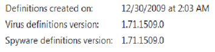
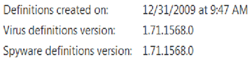

Microsoft Security Essentials (MSE) is Microsoft's free Antivirus Software which helps protecting clients against viruses and spyware. For years I had used other free Antivirus programs on my home based clients, but have switched them all to MSE since it’s release in September 2009. 

  The MSE binaries are located in the following folder:* C:\Program Files\Microsoft Security Essentials*. In that folder we also find the MpCmdRun.exe which provides a command line interface for MSE. The tool provides the following options:

  **-? / –h**    
Displays all available options for this tool

  **-Trace [-Grouping #] [-Level #]**    
Starts diagnostic tracing

  **-RemoveDefinitions [-All]**    
Restores the installed signature definitions to a previous backup copy or to the original default set of signatures

  **-RestoreDefaults**    
Resets the registry values for Microsoft Antimalware settings to known good defaults

  **-SignatureUpdate [-UNC]**    
Checks for new definition updates

  **-Scan [-ScanType]**     
Scans for malicious software

  **-Restore -Name <name> [-All]**     
Restore the most recently or all quarantined item(s) based on name

  **-GetFiles**    
Collects support information

  When I booted my Windows 7 client this afternoon, the virus and spyware definition status was set as shown in the picture below. 

   After running mpcmdrun –SignatureUpdate the definition files were updated. 

  

  When using the –scan option you can define whether you want to run a default, quick or full system scan. To run a quick scan simply type MpCmdRun –scan –1 at the command prompt. 

  By running MpCmdRun –Getfiles a file called *MPSupportFiles.cab* is being generated and stored under *C:\ProgramData\Microsoft\Microsoft Antimalware\Support*. The cab file contains all relevant data related to MSE. (log files, registry settings and events)

  **Additional Information     
**[Microsoft Security Essentials Home](http://www.microsoft.com/Security_Essentials/)    
[MSE – Microsoft Security](http://www.microsoft.com/security/products/mse.aspx)    
[How to manually download the latest definition updates for Microsoft Security Essentials](http://support.microsoft.com/kb/971606)

