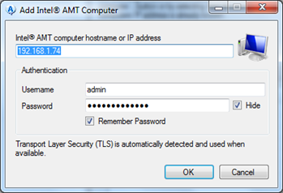
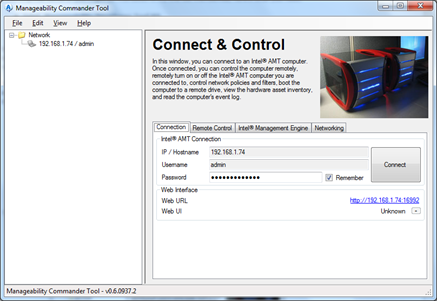
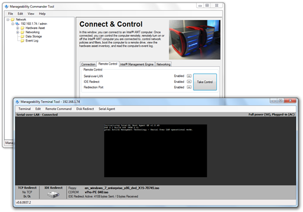
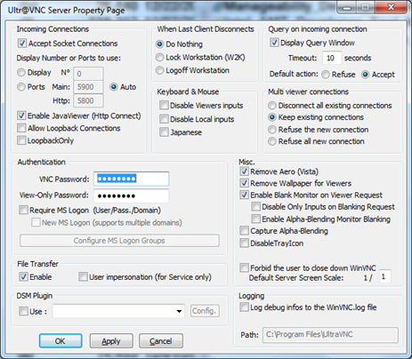
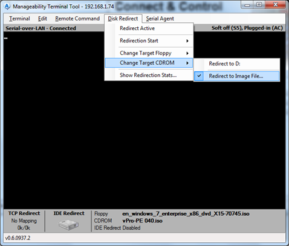
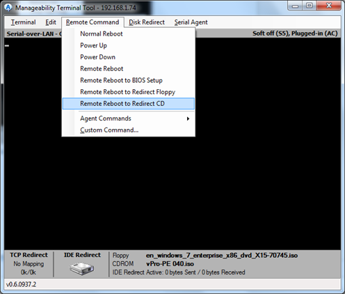
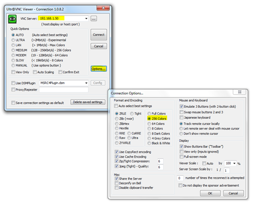
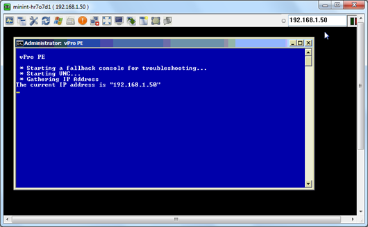

Intel vPro/AMT enabled systems allow you to remotely reboot a system from a redirected CD-ROM aka as IDE-R.  So if one of your users devices doesn't boot its OS properly anymore, you can remotely boot that system with a diagnostics CD that you have stored on your local disk drive. 

  As long as that recovery CD has a text based interface such as the [SystemRescueCD](http://www.sysresccd.org/Main_Page) the system can be remotely managed through the remote VT100 terminal, but unfortunately that doesn’t work for graphical interfaces such as WinPE. So we need an alternative method to remotely manage that device. Since Microsoft’s own remote desktop (RDP) does not work under Windows PE, we are going to use VNC which is small and FREE. 

  Assuming that some of you might be interested to try this out themselves, here’s what you need:

     
- [Intel  Manageability Developer Tool Kit](http://software.intel.com/en-us/articles/download-the-latest-version-of-manageability-developer-tool-kit/)     
- [Windows Automated Installation Kit (AIK) for Windows 7](http://www.microsoft.com/downloads/details.aspx?displaylang=en&FamilyID=696dd665-9f76-4177-a811-39c26d3b3b34)     
- [UltraVNC](http://www.uvnc.com/)  

  You will need two clients, where one serves as your administration console and the other as the client which you are going to remotely manage. Make sure that at least the second client (the one that your remotely manage) have vPro/AMT enabled. Here’s a [video](http://www.youtube.com/watch?v=MsIu0VZi7i0&feature=related) that explains how to configure your client in SMB mode, which is good enough to test this scenario. 

  First install the Intel Manageability toolkit on the Administration Console client, which contains the Manageability Commander Tool and allows us to connect to the AMT enabled device, configure IDE-R and power on and off the machine remotely.  Register the client within the console through File, Add, Add Intel AMT Computer. 

   Once the client is registered click on the “Connect” button. 

   When the connection is established, select the Remote Control Tab and click on the “Take Control” button. 

   Now let’s move to the VNC Installation and configuration. Install UltraVNC Server and Viewer on the Administrator Console client.  When installed, start the VNC Server and configure it.   There are a lot of configuration settings available, configure at least the following ones: *Authentication* – set a password for full and view only access. *Misc* – To avoid graphics related issues, i proactively disabled Aero and Wallpapers. *Query on incoming connection* – Default Action set to Accept. 

  Now copy the following files located under C:\Program Files\UltraVNC\ into a new separate folder like C:\PE_VNC. These are the files that we will integrate into WinPE. 

  authadmin.dll    
authSSP.dll     
ldapauth.dll     
logging.dll     
logmessages.dll     
SCHook.dll     
vnchooks.dll     
workgrpdomnt4.dll     
MSLogonACL.exe     
uvnc_settings.exe     
vncviewer.exe     
winvnc.exe     
ultravnc.ini

  The last thing we need to prepare now is the bootable ISO which includes WinPE. I assume you are familiar with creating a WinPE boot image, if not have a look at the [Walkthrough: Create a Custom Windows PE image](http://technet.microsoft.com/en-us/library/dd744533(WS.10).aspx) documentation on TechNet. Once you are at “Step 5 of the above referenced Walkthrough (Add Additional Customizations) you can add the VNC Server sources that you copied into C:\PE_VNC. 

  To avoid that you get the “Press any key to boot from CD” message when remotely booting the client from the redirected CD-ROM, you must remote the bootfix.bin file from the boot folder within your mounted image. 

  if you are familiar with WinPE, I also recommend that you look at the [Walkthrough: Create an Optimized Windows PE Image](http://technet.microsoft.com/en-us/library/dd744554(WS.10).aspx). Optimizing your WinPE image can help you to reduce the size of your WinPE image, which helps reducing network traffic and boot time. By optimizing my WinPE image I managed to reduce its size from 152 MB down to 98 MB. 

  Now that we have our WinPE ISO file, let’s go back to the Intel Manageability Commander Tool. Select Disk Redirect menu, Change Target CD-ROM, Redirect to Image File and point to the previously created ISO file. Then select the Disk Redirect menu again and select Redirect Active.    
 Finally we can now boot the remote client from the redirected CD-ROM. Select Remote Command, Remote Reboot to Redirect CD. 

   Because now the whole ISO file content is being transferred over the wire, you will have to be patient, booting from a redirected CD-ROM can easily take a few minutes.  Remember that we removed the bootfix.bin file form WinPE, so if all goes well, the client will immediately boot into WinPE. 

  There is one thing which i have not yet figured out, and that is a convenient way how to find out the assigned IP address of the remote client, but maybe that is just an issue related to my test environment. So for the my own convenience I added some code to the startnet.cmd batch file, which displays the assigned IP Address. 

  Below you find the most important part of the startnet.cmd 

  : enable networking     
wpeinit      
: disable firewall      
wpeutil disablefirewall 

  :: +--------------------------------------------------------------------+     
:: Start a minimized command prompt for troubleshooting      
:: +--------------------------------------------------------------------+      
echo  * Starting a fallback console for troubleshooting...      
start /min cmd.exe /k trouble.cmd 

  :: +--------------------------------------------------------------------+     
:: Launching VNC      
:: +--------------------------------------------------------------------+      
echo  * Starting VNC...      
x:      
cd x:\vnc      
start winvnc.exe 

  Echo  * Gathering IP Address     
IPCONFIG |FIND "IP" > %temp%\TEMPIP.txt      
FOR /F "tokens=2 delims=:" %%a in (%temp%\TEMPIP.txt) do set IP=%%a      
del %temp%\TEMPIP.txt      
set IP=%IP:~1%      
echo %IP% >%temp%\ip.txt      
echo The current IP address is "%IP%"

  So let’s assume you know the IP address (the user was kind enough to read it for you) you can now initiate a remote desktop session through the VNC Viewer. I personally had an issue where the VNC viewer crashed right after establishing the connection with the remote client. I managed to get rid of that by setting the Connection Options to only use 256 Colors instead of Full Colors. 

   If all went well you should now be able to remote control your client. 

  

  

  

  

  

  

  

  

  I hope this was useful. As always, feedback and comments are more than welcome. 

  Alex

