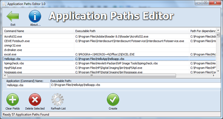
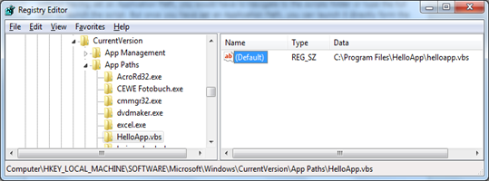

The Application Paths Editor allows you to add, edit and remove Application Paths. Setting an application path for your favorite application or script allows you to run the application directly from the “Run” dialog at the Start Menu. 

  So assume you have a script called “HelloApp.vbs” which is stored under C:\Program Files\HelloApp without having set an Application Path, you would have to navigate to the scripts folder or type the full path to launch the script. But once you have set an Application Path, you can launch it directly form the run dialog at the Start Menu. 

   Application Paths are stored in the Windows Registry, so if you are familiar with editing the Registry, you can of course also add Application Paths directly there. 

    The Application Paths Editor can be downloaded from [here](http://leelusoft.blogspot.com/2009/11/application-paths-editor-10.html)

