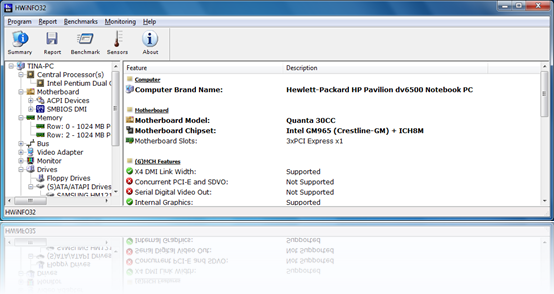
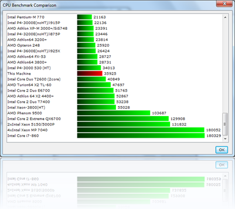

Today’s ToolTip is about [HWiNFO32](http://www.hwinfo.com/index.html) which is a hardware information and diagnostic tool. I have seen many tools that can collect hardware information but this one gives me an impression of being a well organized utility and most important it’s FREE.

  I recommend that you [download](http://www.hwinfo.com/download32.html) the portable ZIP file as that doesn’t require an install.

   Beside collecting detailed hardware information, HWiNFO32 also includes a Benchmark feature that compares the current system components against other components. The below screenshot shows the ranking of one of our home notebooks.

  

  All collected information can be exported in various formats like XML, HTML, CSV, MHTML, Text log file or as short report. HWiNFO32 can be downloaded from [here](http://www.hwinfo.com/download32.html)

