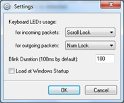

Network Lights developed by Igor Tolmachev is a Windows program, which blinks keyboard LEDs (Light Emitting Diode) indicating outgoing and incoming network packets on network interface. 

  Network Lights lets you monitor network activity (upload/download) from your keyboard ScrollLock and NumLock indicators. Each LED will flicker when network traffic is detected.

   

  Network Lights can be downloaded from [here](http://www.itsamples.com/network-lights.html).

