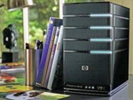
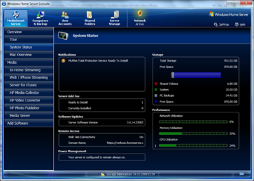
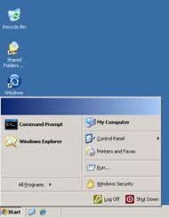
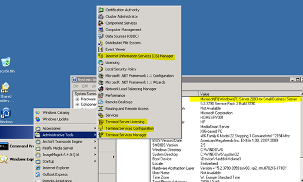

This week I bought a HP MediaSmart Server EX490 which runs Windows Home Server. The primary reason for buying a Windows Home Server was to get an easy to use solution in place that allows us to perform automated backups and share the data across the multiple devices. 

  The most important computer at home is my wife’s notebook, as this has become a kind of the primary access point for the family  to store pictures, music and documents. 

  I started installing it yesterday evening before going out with some friends, of course I joined them too late as I got distracted by the installation process. I completed the installation and configuration this morning and must say that from what I have seen so far, it has exceeded my expectations.

  As you can see from the picture below the device is quite small which is good because you are most likely going to place it somewhere under a desk. 

   Note that the Home Server is designed to be a headless system, which means that you cannot attach any keyboard, mouse  or monitor to it. All Administration is done via the remote Home Server Console. 

  

  If you are interested to learn more about the Windows Home Server, then I recommend that you look at the links I have listed below under Additional Sources. Especially the [Review of the HP MediaSmart Server](http://www.mediasmartserver.net/2009/09/14/review-hp-mediasmart-server-ex490-and-ex495/) from MediaSmart.net provides a very detailed overview of what you can all do with this device. 

  Have a look at the following video’s so you get an idea of what you can all do with this awesome device. 

 [HP MediaSmart Server - How to enable remote access](http://www.youtube.com/watch?v=lCrUCg3ROPg)   
[HP MediaSmart Server - Using HP Photo WebShare](http://www.youtube.com/watch?v=QHwEmMAV0sk&feature=related)   
[HP MediaSmart Server - How to back up your files    
](http://www.youtube.com/watch?v=CMOZVgFswUI&feature=related)   

  **Under the Roof**

  As an IT pro I wanted to know what’s under the roof. As a regular user you will perform all administration tasks using the Windows Home Server Console but you can also logon to the server through a remote desktop session. mstsc /v:<HomeServer Computername or IP address>. 

  Once logged on you will notice that it looks like if you would log on to a normal Windows Server, there are just fewer things there. 

   We could say that basically the Windows Home Server is a customized, stripped down “Server 2003 SP2 for Small Business Server” system. 

  As you can see from the screenshot above, it has the Internet Information Services (IIS) installed as this is used to remotely access the shared content through the internet. I haven’t been able to find a confirmation yet, but would assume that in fact you can install everything that works on Server 2003 SBS. I wonder when Windows Home Server will be made available with the Server 2008 codebase as the Small Business Edition is already available on that platform. 

  Windows Home Server, definitely a Must Have !

  **Additional Sources      
**[HP MediaSmart Server EX490 Overview](http://h20331.www2.hp.com/hho/cache/565653-0-0-225-121.html)     
[Home Server Plus](http://www.whsplus.com/)     
[Microsoft Windows Home Server Forum](http://social.microsoft.com/Forums/en-US/category/windowshomeserver)     
[MediaSmartServer.net](http://www.mediasmartserver.net/)     
[Windows Home Server Team Blog](http://blogs.technet.com/homeserver/)     
[Windows Home Server Home](http://www.microsoft.com/windows/products/winfamily/windowshomeserver/default.mspx)     
[MSWHS Blog](http://mswhs.com/)     
[We Got Served](http://www.wegotserved.com/)     
[Microsoft + HP Windows Home Server WebCast](http://go.microsoft.com/?linkid=9045040)     
[Review: HP MediaSmart Server EX490 and EX495](http://www.mediasmartserver.net/2009/09/14/review-hp-mediasmart-server-ex490-and-ex495/) from MediaSmartServer.net     
[Review: HP MediaSmart Server EX490](http://www.pcpro.co.uk/reviews/desktops/352870/hp-mediasmart-server-ex490) from PC Pro     
[Show us your tech video with Mark Pendergrast](http://on10.net/blogs/larry/Show-Us-Your-Tech-Mark-Pendergrast-Edition/)     
[HP StorageWorks Data Vault Windows Home Server](http://www.youtube.com/watch?v=YNj3s8qmxE0)     
[HP MediaSmart Server video](http://www.youtube.com/watch?v=sVGmeE2zzXk)     
[Product Review - HP MediaSmart Server](http://www.youtube.com/watch?v=iwRaT1onAFM&feature=related)     
[HP MediaSmart Easter Egg for the LED](http://www.homeserverhacks.com/2007/12/hp-ex470ex475-mediasmart-server-easter.html)     
[HomeServer Hacks](http://www.homeserverhacks.com/)     
[HomeServerLand](http://www.homeserverland.com/)     
[Wikipedia – Home Server](http://en.wikipedia.org/wiki/Windows_Home_Server)    
[HP MediaSmart Wiki](http://www.mediasmartserver.net/wiki/index.php/Main_Page)

