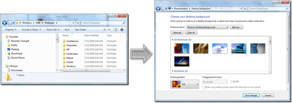
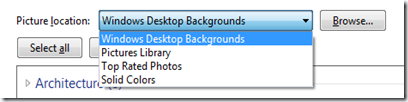
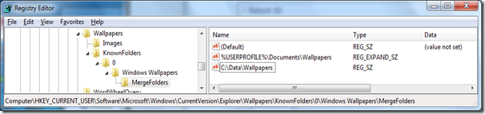
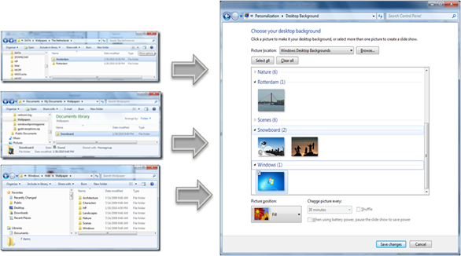

When opening the “Change Desktop Background” Control Panel Windows by default uses the “Windows Desktop Backgrounds” picture location which is the content stored under C:\Windows\Web\Wallpaper

   

  In addition to the Windows Desktop Backgrounds location Windows also let you choose a Wallpaper from other locations such as the Picture Library, Top Rated Photos, Solid Colors or you can simply browse and select a Wallpaper that is stored anywhere on your computer. 

   

  But there is another option, that I figured out today and wanted to share with you. To demonstrate this I have created the following folders and copied a wallpaper file in each of the folders. 

  C:\Users\Alex\Documents\Wallpapers\Snowboard     
C:\DATA\Wallpapers\The Netherlands\Amsterdam

  Now we have to tell Windows that we want to include these 2 folders into the “Windows Desktop Backgrounds” listing. To do that, we have to modify the Windows Registry. Open the Registry Editor (Regedit.exe) and navigate to the following key:

  HKEY_CURRENT_USER\Software\Microsoft\Windows\CurrentVersion\Explorer\Wallpapers\     
KnownFolders\0\Windows Wallpapers\MergeFolders

  Now create a new String or Multi String value for each folders that you want to include. Note that if you use variables in the folder name, you must create a Multi String Value (REG_EXPAND_SZ) otherwise a String Value (REG_SZ) is enough. 

   

  The Result. When opening the “Change Desktop Background” Control Panel the Wallpapers from all the 3 different Wallpaper folders are being displayed. 

  

