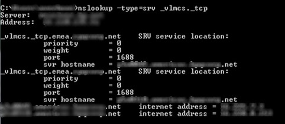

Assume you are at a client site and plan to deploy a Windows Server (2008 / 2008-R2) or Windows Clients (Windows Vista / Windows 7) and want to check if they do already have KMS Services running on their network. 

  It’s very simple. Just open a command prompt and type the following command:

  nslookup -type=srv _vlmcs._tcp

  If KMS Services are present on the network the results will be listed as shown in the picture below. 

   

  **Related Content      
[Upgrade your existing KMS Service to support Windows 7 and Windows 2008 R2](https://www.verboon.info/index.php/2009/08/upgrade-your-existing-kms-service-to-support-windows-7-and-windows-2008-r2/)       
[Volume Activation changes in Windows7](https://www.verboon.info/index.php/2009/07/volume-activation-changes-in-windows7/)       
[Fundamentals of Volume Activation](https://www.verboon.info/index.php/2009/08/fundamentals-of-volume-activation/)**

