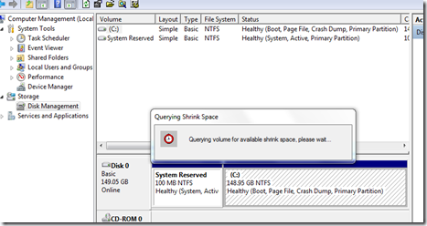
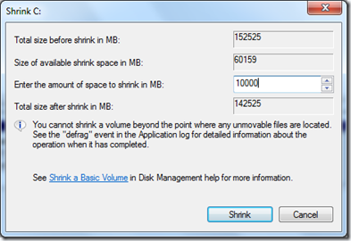
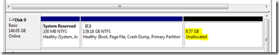
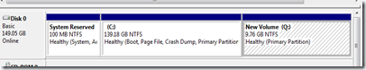

I am currently doing some training on App-V and for the sequencing of Applications there is a requirement to have 2 Partitions running on the system on which you sequence the application. Unfortunately I had setup my Windows 7 lab PC with only one partition. A couple of years ago you would have ended up using some 3rd party tools to repartition your system but nowadays (actually since Windows Vista) this is something that takes no more than 10 minutes. 

  If you are doing this on your primary system (the one you use at home or at work) I recommend that you make a backup of your critical data anyway. When you’re ready to go, open Disk Management and right click on the disk you want to shrink, select the “Shrink Volume ” option. The system will now analyze your local disk, this can take a while. 

   

  As a next step you can specify the amount of MB to shrink. 

  

  In my case I shrinked the volume by 10 GB. After a while you will see the new available space in Disk Manager.  Then select Unallocated data and format it. 

   That’s it

