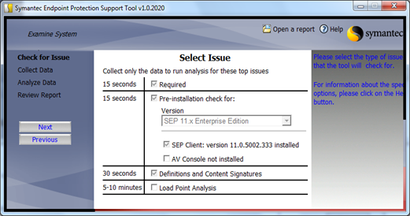
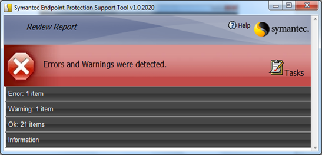
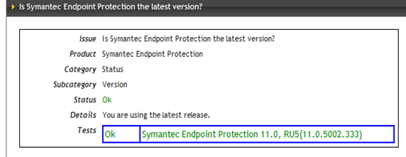

I’m currently busy with integrating the Symantec Endpoint Protection software into a Windows 7 build for one of our customers. I wondered if the Security team had really provided me with the latest and greatest version and ended up searching for that information on the Symantec web site where I came across a post mentioning the Symantec Endpoint Protection Support Tool.

For those that have a SEP 11 version prior RU5 the tool can be downloaded from [here](http://service1.symantec.com/SUPPORT/ent-security.nsf/docid/2008071709480648) and as of RU5 (11.0.5002.333) the tool can also be downloaded from within the Symantec Endpoint Protection client by opening the Client user interface and selecting *Help & Support* > *Download Support Tool*.

 when completed all results are listed in categories.

 and for my case, answering my question whether I am using the latest and greatest version.

The tool provides much more information than just the current version, so if you are a Security Professional (then you probably know this tool already) or an IT Pro this is a must have for SEP troubleshooting or information gathering.

Additional Information: (thanks to Grant Hall)
[About the Symantec Endpoint Protection Support Tool](http://service1.symantec.com/SUPPORT/ent-security.nsf/docid/2008120810393048)
[The Symantec Endpoint Protection Support Tool](http://service1.symantec.com/SUPPORT/ent-security.nsf/docid/2008071709480648)

