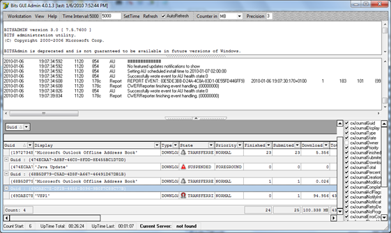

In an earlier post [Using BITS for file downloads](Using BITS for file downloads) I wrote about how to use BITS for file transfers. Today I had a BITS related topic at work, so needed a brief refresher and found some additional interesting things.

  First I came across a [TechNet Utility Spotlight article Scripting Trouble-Free downloads with BITS](http://207.46.16.252/en-us/magazine/2006.08.utilityspotlight.aspx). If you are interested in creating your own BITS based download scripts, read this article and [download](http://download.microsoft.com/download/f/d/0/fd05def7-68a1-4f71-8546-25c359cc0842/UtilitySpotlight2006_08.exe) the provided bitsjob.vbs and bitsjob.cmd files. Note that the article is dated back from 2006, so no mention about Windows 7 here, but no worries bitsadmin.exe is included in Vista and Windows 7 already.

  But then a few clicks later I came across this awesome nice FREE Tool called Bits GUI Admin. The tool provides a detailed view on all running BITS processes on your machine, so useful for troubleshooting as well. Note that the utility download does include a (old) bitsadmin.exe as well, but if you are running Windows Vista, Windows 7 or Server 2008(R2), I recommend that you overwrite that with the version of the OS. If you are running Windows XP or Server 2003, use the latest version which is available in the Service Pack 2 SP2 support tools.

  The tool does not require installation, so just extract the files, update if the bitsadmin.exe if you like  and launch the bitsguiadmin.exe as Administrator. If you don’t see any existing processes running, simply go to Windows Update and select an available optional or security update to be installed or run a bitsadmin.exe command as described in one of [my previous posts](https://www.verboon.info/index.php/2008/08/using-bits-for-file-downloads/).

  

  Bits GUI Admin can be downloaded from [here](http://maton.com.ua/en/bitsguiadmin/screenshots)

  **Related Articles**
[Vista SP1 download using BITSADMIN](https://www.verboon.info/index.php/2008/11/vista-sp1-download-using-bitsadmin/)
[Using BITS for file downloads](https://www.verboon.info/index.php/2008/08/using-bits-for-file-downloads/)

