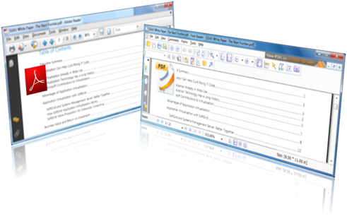

Yesterday evening I was reading [Justin Rodino’s](http://www.227volts.com/?page_id=2) blog post “[Dear Adobe, I Don’t Want Your Stupid Desktop Icon (nor your software anymore)](http://www.227volts.com/?p=1242)” where he mentions the Foxit Reader which is an alternative PDF Reader.

  Since the Adobe Reader has become the de facto standard for reading PDF files, most people don’t spend any thoughts on replacing it by another software product.  Personally I don’t have much of an issue with the desktop shortcut it creates (Justin does..), but I have always been wondering why the Adobe Reader has such a large footprint. A fresh install of the Adobe Reader 9.03 takes approx. 213 MB, when removing the Setup Files which are left in the application installation folder, the Reader still consumes 99 MB. To install Adobe Reader you must first download the Adobe Reader installer which is 27 MB.

  To Install the Foxit Reader you must download the Setup package which is only 5.3 MB and once installed the Foxit Reader only uses 9.6 MB. In all fairness I did not look at the functionality differences of the two tools, well possible that the Adobe Reader does provide more functionality and therefore requires a larger footprint. However most of us use the Adobe Reader just to read PDF files and that is what the Foxit Reader allows you to do as well, with just a much smaller application footprint.

  

  The Foxit Reader can be downloaded from [here](http://www.foxitsoftware.com/downloads/index.php) and a feature overview can be found [here](http://www.foxitsoftware.com/pdf/reader/reader3.php). The Foxit Reader is available for Windows, Linux, and Windows Mobile.

