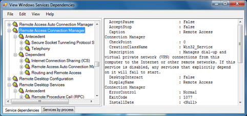

During my periodic visit on CodePlex I came across the Windows Services Dependency Viewer utility. The tool provides access to the following information:

     
- Windows service dependent and antecedent services    
- Services grouped by process    
- Service details (from Win32_Service WMI class)    
- Service process details (from Win32_Process WMI class 

  This tool might come in handy once you start changing a specific Service’s startup mode. 

  

  The Windows Services Dependency Viewer can be downloaded from [here](http://svcdependencyviewer.codeplex.com/) Additional documentation can be found [here](http://svcdependencyviewer.codeplex.com/documentation)

  **Related Posts**    
[Windows Services, what changed from Vista to Windows7 Part1](https://www.verboon.info/index.php/2009/04/windows-services-what-changed-from-vista-to-windows7-part1/)    
[Windows Services, What changed from Vista to Windows7 – Part2](https://www.verboon.info/index.php/2009/04/windows-services-what-changed-from-vista-to-windows7-part2/)

