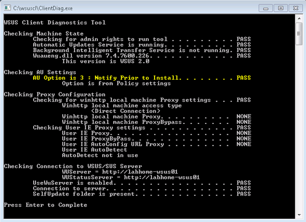

Having trouble with a client not getting updates from your Windows Update Services Server ? Then have a look at the WSUS Client Diagnostics Tool.  The tool performs various system checks and tests the communication between your client and the WSUS server. 

   

  The Tool can be downloaded from the [Windows Server Update Services Tools and Utilities](http://technet.microsoft.com/en-us/wsus/bb466192.aspx) site at Microsoft TechNet.

