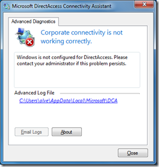

For those of you that do already use Windows 7 DirectAccess or plan to do so in the near future have a look at the Microsoft DirectAccess Connectivity Assistant (DCA). 

  *The Microsoft DirectAccess Connectivity Assistant (DCA) helps organizations reduce the cost of supporting DirectAccess users and significantly improve their connectivity experience. DCA informs mobile users of their connectivity status at all times; provides tools to help them reconnect on their own if problems arise; and creates diagnostics to help mobile users provide IT staff with key information if necessary—all to help customers operate with more efficiency, and at a lower cost.*

  DCA adds an icon to the Taskbar and informs users about their DirectAccess Connectivity Status and Configuration. 

   

  More information and download details for DCA can be found [here](http://www.microsoft.com/downloads/details.aspx?displaylang=en&FamilyID=9a87efe8-e254-4473-8a26-678adea6d9e9&utm_source=feedburner&utm_medium=feed&utm_campaign=Feed%3A+MicrosoftDownloadCenter+(Microsoft+Download+Center))

  **Related Articles     
**[Windows7 – DirectAccess video](https://www.verboon.info/index.php/2009/03/windows7-directaccess-video/)    
[DirectAccess in Windows 7 and Windows Server 2008 R2](https://www.verboon.info/index.php/2009/02/directaccess-in-windows-7-and-windows-server-2008-r2/)

